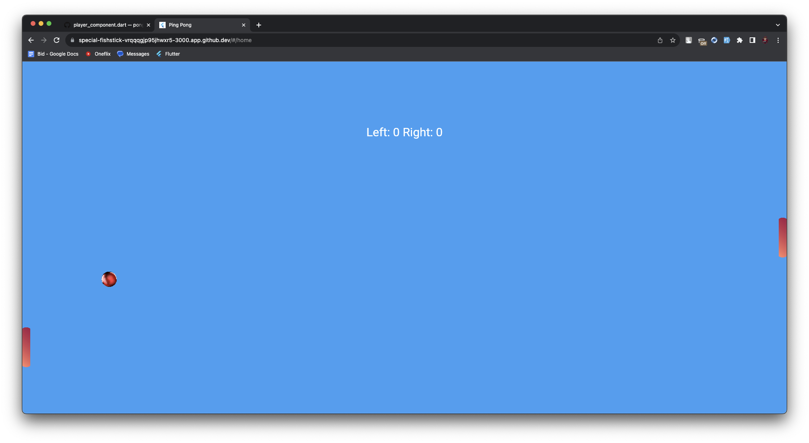
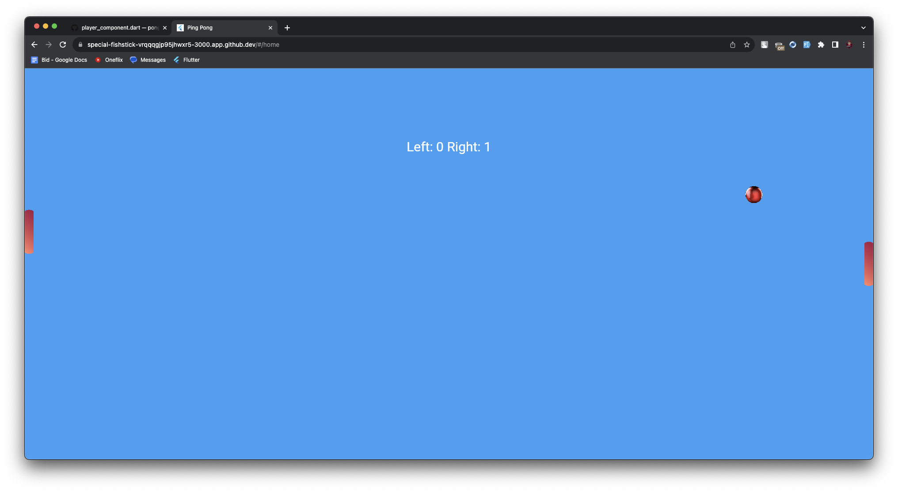

# Ping Pong

A simple ping pong game made with Flame and Flutter.

## Getting Started

1. Clone the repository with `git clone https://github.com/wonderkidshihab/pong` .
2. Open the project in your favorite editor.
3. Get the dependencies with `flutter pub get` .
4. Run the project with `flutter run` .

## Screenshots

